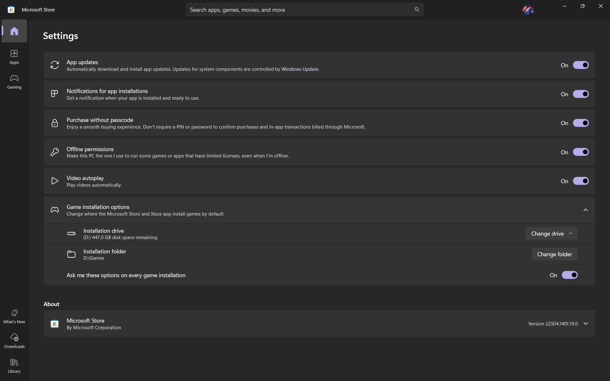

# error-0x87e000C8-fix

The drive won’t appear as a valid install location under Storage settings or inside the Store/Xbox App.

---

## 💡 The Fix (Discovered by a 16 y/o student)
This shockingly simple fix solved everything for me — without needing advanced hacks or risky tweaks.

### ✅ Steps:
1. Plug in your external SSD (mine was Crucial BX500 via USB 3.0 enclosure)
2. Right-click the drive → **Properties**
3. Go to **Sharing** tab → click **Advanced Sharing**
4. ✅ Check “Share this folder”
5. Click **Permissions** → select **Everyone** → enable **Full Control**
6. Hit OK / Apply, close the dialog.
7. Open Xbox App or Microsoft Store. Your drive will now appear as a valid installation option.

🎮 I tested it by installing Minecraft and it downloaded without any errors or complaints.

---

## 🧪 Tested On:
- Windows 11 Home
- Crucial BX500 480GB SSD (external)
- Microsoft Store + Xbox App
- Game tested: Minecraft (Game Pass)

---

## 📸 Screenshots:
See [`/images`](./images/) folder for step-by-step visuals:

---

## 🙋‍♂️ Who Am I?
I'm **Arpan**, a 16 y/o student who likes breaking and fixing things. I’m self-taught, curious, and love solving weird tech issues.  
If anyone at Microsoft (or anywhere cool) is reading this — I’d *love* an internship opportunity someday 👀

---

## 🧠 Why This Works (Probably):
The Microsoft Store and Xbox App use internal permission checks that reject drives without proper network/share access.  
By granting shared access via SMB (even locally), the Store likely whitelists the drive as installable.

---

## 🪪 License
MIT License – see [`LICENSE`](./LICENSE) for details.  
Use it freely, modify it, share it — just don’t sue me 😅  
Attribution appreciated but not required 💜
